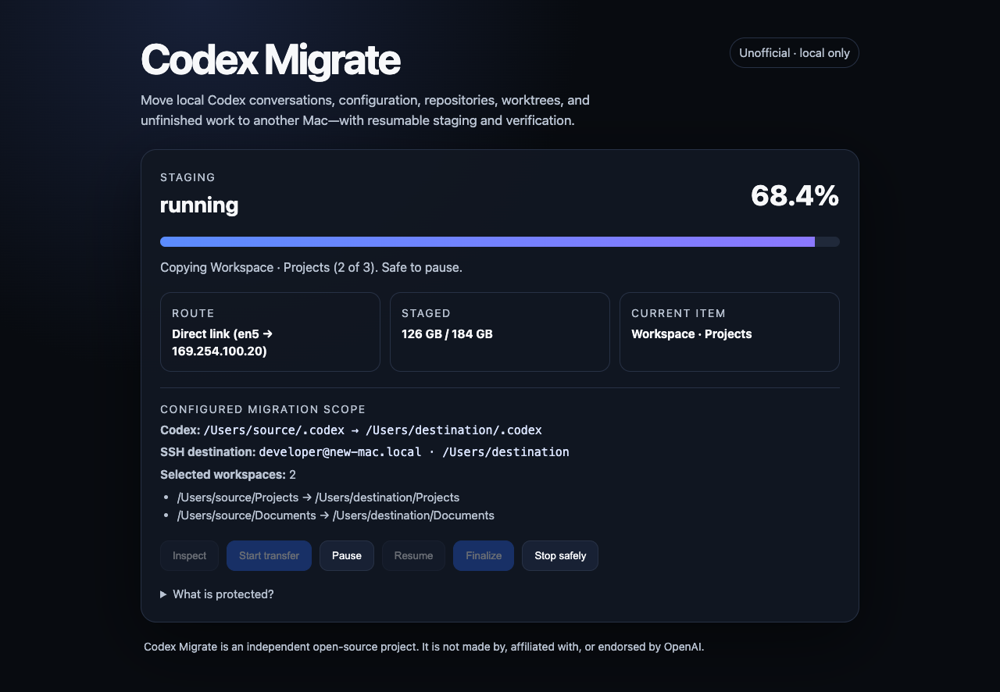

# Codex Migrate

**Unofficial, privacy-first Mac-to-Mac migration for local Codex workspaces.**

Codex Migrate moves the local working state that does not magically appear when
you sign into Codex on a new Mac: conversations, project organization,
configuration, skills, automations, repositories, branches, worktrees, stashes,
and unfinished files.

It stages a resumable copy over SSH, preserves the new Mac's authentication,
creates a rollback backup, installs only after both Codex apps are closed, and
verifies the result before declaring completion.

The close-Codex requirement applies to the **source and destination migration
accounts**, not unrelated users logged into the same Macs. It includes known
Codex app and CLI/background-engine executable names. The helper must run as
the non-root owner of the selected home, with matching real and effective user
IDs; do not run it with `sudo`. Failed or ambiguous process inspection blocks
finalization. Changing `HOME` to a temporary folder does not isolate processes
running under the same account. Keep all writers to selected data closed:
process-name checks cannot detect renamed executables or prevent later launches.

Destination replacement is blocked unless the mandatory backup passes content
and structure verification and sufficient free space is available. There is no
skip-backup option. Same-disk backups do not protect against disk failure;
keep the old Mac intact. See [backup and recovery details](docs/recovery.md).

> **Alpha:** This project was extracted from a successful real-world migration
> spanning hundreds of gigabytes. The core safety model is implemented and
> tested, but the public CLI
> still needs broader hardware and Codex-version testing. Read the plan before
> using `--apply`.

Codex Migrate is an independent project by Joshua Segeren. It is not made by,
affiliated with, supported by, or endorsed by OpenAI. OpenAI and Codex are
trademarks of their respective owner.

**Website:** [migrate.segeren.com](https://migrate.segeren.com)



## Why this exists

I changed Macs and discovered there was no documented, end-to-end way to move
my complete local Codex workspace. Signing in on the new computer did not
restore the working environment I depended on.

The workspace included thousands of conversations, archived tasks, multiple
projects, local Git branches and worktrees, uncommitted work, custom skills,
automations, and hundreds of gigabytes of source files. Apple's Migration
Assistant stalled. I built the migration tool I needed, then turned it into an
open project so nobody else has to reconstruct the process under pressure.

## What it transfers

- Active and archived local Codex conversations
- Codex configuration, project organization, skills, rules, memories, and
  automations
- User-selected workspace roots, including complete `.git` directories
- Local branches, remote refs, tags, stashes, linked-worktree metadata, and
  uncommitted or untracked files contained in those roots
- Relevant local Codex state required to resume work

Full inspection lists Git locations in the selected workspace folders and
`~/.codex/worktrees`. It checks linked worktrees, shared Git directories,
alternate object stores, and linked Git metadata, including intermediate
aliases. If required storage or a registered existing worktree is outside the
selection, transfer stops before connecting to the destination. Restart setup,
add the reported folders, and inspect again. Dependencies are never silently
added to the copy scope. Already-missing registered worktrees are reported as
warnings; their registrations are not removed.

This is dependency discovery, not a scan of every folder on the Mac. Workspace
directory links are not searched for additional repositories. Unsupported
pointers, broken metadata links, unreadable metadata, and dependencies outside
the source home require review. A separate post-install Git check compares the
discovered scope with a saved source baseline; see Git verification below.

Folder selection rejects case/Unicode aliases of protected Codex, SSH, personal
skills and migration-control paths, including relocated protected directories.
Ambiguous spellings of selected workspace roots are rejected rather than
silently combined. Inspection and each copy attempt also screen nested names in
selected workspaces, retained Codex state, managed worktrees and personal skills.
Source tree verification repeats the check before replacement. Case-folding or
Unicode-normalization collisions and invalid UTF-8 names require review; no
automatic renaming is performed. These conservative checks also apply when both
Macs use case-sensitive storage. They are not an exact emulation of every
filesystem's Unicode rules or a search for credentials under unrelated names.
Excluded runtime subtrees are not searched, although their names still participate
in the sibling check. Workspace directory links are preserved rather than traversed.

Source inspection also rejects macOS files and folders marked as cloud-only
(`SF_DATALESS`) before reading their contents or enumerating those folders.
Download and keep selected data locally using its cloud provider, then inspect
again. The same metadata screening runs before staging/resume and source
verification, including skill file-link targets that will be materialized.
It does not download files automatically. Ordinary sparse files are supported.
This detects a known macOS flag, not every provider's placeholder format or
files evicted after inspection. Cloud-provider and offline behavior still need
real-system acceptance; keep the old Mac and its files intact.

Full migrations also discover personal custom skills in `~/.agents/skills`
and legacy `~/.codex/skills`. A current-location skill takes precedence over a
legacy skill with the same name. Each selected skill is materialized at the new
Mac's `~/.agents/skills/<name>` with verified backup and file-content checks;
unrelated destination skills are retained. The dashboard lists the selection
and distinguishes selected from verified skills.

The personal-skill pass excludes `.system` and ordinary files directly in a
skill root, such as Finder metadata. Broken aliases, unreadable skills,
unsupported skill-directory names, external links, and nested directory links
stop inspection instead of silently omitting a skill. Do not select a workspace
overlapping `~/.agents/skills`; it is handled separately. This does not change
the byte-for-byte copying of skills inside selected project workspaces.

## What it deliberately does not transfer

- `~/.codex/auth.json`
- `~/.codex/installation_id`
- The source Mac's `~/.ssh` directory and its private keys
- Codex's top-level runtime sockets, process locks, logs, and disposable caches
- Other home-directory data outside Codex state, discovered personal skills,
  and explicitly selected workspace roots

Selected workspace roots are copied byte-for-byte. Audit them before transfer:
a credential stored inside a selected repository or workspace is part of that
workspace and will be copied.

Codex runtime exclusions are root-anchored. They do not strip a repository's
`logs`, `cache`, `packages`, or similarly named branches and files inside
`~/.codex/worktrees`. Those managed workspaces are also complete workspace
copies and can contain credentials; review them before migration.

The new Mac must have Codex installed, opened, and signed in once before the
migration. Its authentication and installation identity are retained and
verified after installation.

## Requirements

- Two Macs
- Python 3.9 or newer on the source Mac
- Remote Login enabled on the destination Mac
- `ssh` and `rsync` available on both Macs
- System Perl with `Digest::SHA`, `Time::HiRes`, `Encode`, `Unicode::Normalize`,
  and no-follow file support on
  both Macs (checked during full-migration inspection)
- An APFS destination home volume (required for space-efficient rollback)
- An SSH connection whose host key has already been verified
- Apple Command Line Tools or Xcode with compatible Git and working macOS
  sandbox support on both Macs for the separate Git verification step
- Enough free destination space for staging, a safety backup, and the final
  workspace

Codex Migrate never disables SSH host-key verification. Connect manually once
before using the tool:

```bash
ssh new-user@new-mac.local
```

Confirm the host fingerprint, then exit that SSH session.

## Quick start

Clone the repository on the old Mac:

```bash
git clone https://github.com/jsegeren/codex-migrate.git
cd codex-migrate
chmod +x ./codex-migrate
```

For guided local browser setup instead of command-line configuration, run
`./codex-migrate launch` on the old Mac. It opens destination and folder
selection, then the real migration dashboard. No transfer starts automatically;
changes are disabled unless you explicitly enable them for that session.
Browser-created migrations restore their last configuration on reopening.
If you already started through `serve` or native setup, resume through that
same entry point; browser setup does not import its migration records.

Or inspect the local source from the command line:

```bash
./codex-migrate inventory \
  --workspace "$HOME/Git" \
  --workspace "$HOME/Documents"
```

Run destination preflight in read-only planning mode:

```bash
./codex-migrate inspect \
  --target new-user@new-mac.local \
  --target-home /Users/new-user \
  --workspace "$HOME/Git"
```

Start the local dashboard with mutation enabled:

```bash
./codex-migrate serve \
  --apply \
  --target new-user@new-mac.local \
  --target-home /Users/new-user \
  --workspace "$HOME/Git"
```

The dashboard binds only to `127.0.0.1`. Its controls require a random
owner-only token carried in the URL fragment, which browsers do not send to the
HTTP server or remote Mac.

## Selective component export

For a browser-guided repair, run `./codex-migrate launch` and choose **Custom
skills only**. Select personal skills, workspace skills, or both. Workspace
folders are searched for `.agents/skills`; the rest of those projects is not
copied. Inspect the destination list, start staging, then quit Codex on both
Macs and confirm Finalize. Only the listed skills are backed up and replaced.

Browser skills repairs have a separate saved setup and owned staging folder.
Pause, Stop safely, and Resume use the same transfer controls as a full
migration. Reopening restores the mode and categories, but destination changes
must be enabled again. Existing full-migration staging is not adopted or
overwritten. The CLI `export` command below remains a one-pass alternative; its
older staging is not imported into the browser flow.

You do not need to repeat a large migration to repair a missing skill. The
`export` command can independently stage, back up, install, and verify personal
skills or repository-scoped workspace skills. It materializes top-level skill
aliases and file links only after proving their targets stay inside the source
home. Nested directory links are rejected. User-wide skills are installed in
the current documented `~/.agents/skills` location so a macOS username change
does not leave broken absolute links.

Plan a personal-skills-only repair:

```bash
./codex-migrate export \
  --component personal-skills \
  --target new-user@new-mac.local \
  --target-home /Users/new-user
```

Apply both personal and workspace skill repairs:

```bash
./codex-migrate export \
  --apply \
  --component personal-skills \
  --component workspace-skills \
  --target new-user@new-mac.local \
  --target-home /Users/new-user \
  --workspace "$HOME/Git"
```

Each destination skill is backed up before replacement. Other skills and all
conversation, configuration, authentication, and repository data are left
untouched. Staged and installed skills are compared with a frozen source
file-content and directory-tree snapshot. Rerunning the command is safe.
Additional independently selectable
components will follow the same stage → backup → install → verify contract.

## Migration phases

1. **Inspect** — verify source state, destination identity, SSH safety, required
   tools, selected workspaces, counts, and estimated size.
2. **Stage** — copy into an isolated destination staging directory using
   resumable `rsync --partial`. Source files are never modified.
3. **Pause or stop safely** — suspend the active transfer or terminate it while
   retaining staged data. Resume reruns the same copy and reuses completed data.
4. **Finalize** — require Codex to be closed on both Macs, refresh the final
   delta, freeze source workspace checks, verify staging, clone a destination
   backup, and move the staged data into place on
   the same volume without creating a second full-size copy.
5. **Verify** — compare conversation counts, run SQLite integrity checks, and
   prove destination authentication and installation identity did not change.
   Active and archived transcript bytes and relative paths must match the same
   frozen SHA-256 snapshot before replacement and after installation. A mismatch
   blocks replacement or triggers rollback; counts alone cannot prove success.
   Personal skills also receive exact file-content and directory-tree checks
   before and after installation.
   Selected workspaces and `~/.codex/worktrees` must match the same frozen
   SHA-256 tree checks before and after installation, including file bytes,
   names, regular-file/directory permissions, empty directories, and link text.
   Retained Codex state—including configuration, project organization, rules,
   automations and database files—also receives a frozen content/tree check
   before replacement and after installation, before SQLite validation runs.
   The check uses the same root-anchored authentication/runtime exclusions as
   transfer. Managed worktrees remain covered by their separate complete check.

Retained-state verification adds a source read and two destination reads of
that data, including transcripts already checked separately for stricter link
rules. This increases verification time for large conversation histories. Like
workspace verification, its source pass can be stopped safely. Only Codex's
root-directory mode is omitted from this comparison: installation explicitly
restricts that directory to mode 700. Retained child permissions are checked.
SQLite validation can update database sidecars after the byte comparison;
the receipt does not promise files never change afterward.

Source `auth.json` and `installation_id` are never opened by this check.
Noncanonical capitalization of these root filenames blocks transfer because
case-insensitive Mac filesystems could otherwise expose them despite literal
copy exclusions. These are path protections, not general secret detection:
other retained configuration may contain credentials and requires your review.

Workspace verification reads every regular file once on the source and twice
on the destination. Large workspaces can take substantial time; verification
does not reuse the transfer percentage as an estimate. **Stop safely** is
available while reading source workspaces. Resume keeps staged data, but a new
Finalize restarts those checks. Destination verification, backup, installation,
and rechecking form a protected phase: keep both Macs connected and let it finish.
Unreadable or changing files, sockets, pipes, and other special files block
verification; they are not silently excluded. Directory links are preserved as
links, not followed. Contents and checksum values are not logged.

These checks are not an atomic snapshot and do not independently verify ACLs,
extended attributes, ownership, timestamps, or hard-link relationships. Matching
workspace bytes does not prove Git commands work or historical paths resolve on
the destination. Keep writing apps closed and validate the restored workspace.

Conversation verification reads every selected transcript on the source once
and on the destination before and after installation. Large conversation
histories can take time to verify; keep both Macs connected. Transcript contents
and checksum values are not logged. Linked conversation directories/files and
nonregular transcript files block verification rather than silently pass.
These checks prove transcript preservation, not that every historical chat opens
in every Codex version or that all old workspace paths already resolve.

## Custom storage and configuration profiles

Full migration currently supports the selected home's `.codex` folder, not
arbitrary custom storage roots. Before inventory/copying, it checks the visible
`CODEX_HOME` override when the helper is running in that source account. It also
screens `config.toml` and `*.config.toml` user profile files for `sqlite_home`
settings. Destination and staged configuration are checked before replacement.

An override or unreadable/unsafe configuration stops the full migration for
review. Keep the original files and settings intact; contact support rather
than unsetting variables or deleting a setting just to bypass the guard. Any
explicit `sqlite_home` key requires review, even if its value looks like the
default. Ordinary profiles without storage overrides are copied as retained
Codex state, not treated as separate conversation stores.

This is bounded lexical screening, not a TOML validator or an effective-config
resolver. It does not inspect other processes' environments, shell startup
scripts, project/managed config layers or undisclosed custom storage roots.
The destination check sees the SSH environment, which may differ from Finder's.
Skills-only repair still uses the documented skill roots; it does not migrate
custom databases or resolve custom storage. Configuration values and credential
contents never appear in these reports.

OpenAI documents these storage/profile distinctions in
[advanced configuration](https://developers.openai.com/codex/config-advanced/)
and the [`sqlite_home` reference](https://learn.chatgpt.com/docs/config-file/config-reference).

## Different macOS usernames

Older Codex conversation files and Git metadata can contain absolute home paths.
The dashboard checks those home paths during preflight and again after
installation. It distinguishes a direct matching link, a missing old path,
conflicting files or local accounts, and an unverified/unsupported layout.

For a missing ordinary `/Users/name` path, open **Home-path compatibility → Fix
a missing old home path**. Review and copy the generated command, run it in
Terminal on the new Mac, then choose **Check home paths**. It needs an
administrator password and explicitly requires `--apply`. It rechecks local
accounts and creates an exact-path symlink; it cannot overwrite an existing
entry or put a nested link inside a folder. Nothing runs automatically.

Do not use a blind `ln -s` command or remove a conflicting home. Custom home
locations and conflicts require review; no privileged command is offered for
them. The tool does not rewrite historical metadata. A successful installation
keeps its receipt but remains **needs attention** until home paths are verified.
Matching home paths still do not prove every chat opens or every repository
works: validate representative work before retiring the old Mac.

## Git verification after installation

Full finalization saves an owner-only source Git baseline bound to the migration,
selected folders and frozen content evidence. After installation and home-path
verification, the dashboard separately checks discovered destination Git
locations: local object/connectivity checks, HEAD, refs, index and status.
Skills-only repairs do not run or require this repository check.

When repositories are discovered, preflight first checks that the guarded Git
runtime can start on both Macs, without reading repository contents. An
unavailable runtime blocks staging. If the source baseline later cannot be
captured during finalization, replacement stops and staged data is retained.
These early runtime checks are not repository integrity or usability checks.

Open **Git verification → Check Git** to repeat only the read-only check.
**Stop Git check** also stops its preceding home-path check. These actions do
not require changes to be enabled. A failed check, missing Git, disconnect or
restart retains the installation receipt and does not recopy or restore files.
The app stays **needs attention** until checks pass; it does not offer Resume
copying over an installed workspace. Changes since the baseline may be work
you have done on the new Mac, not corruption. Source-existing issues are
reported separately.

Git runs with restricted reads and without writes, network access or subprocess
helpers. Partial clones, custom object-check policies, filters, unsupported
layouts and Git storage outside the probe's selected-folder/managed-worktree
read scopes can need review. Shallow repositories remain shallow. If the source
baseline is unavailable in an older installation, retry cannot reconstruct
the original baseline from today's files: keep the backup and contact support.
The probe currently requires a root-owned Apple-toolchain Git executable;
user-owned/custom toolchain installations can be unavailable for verification.
Do not change ownership or bypass checks simply to obtain a passing result.

These are point-in-time checks, not an atomic snapshot, proof that every chat
opens, or tests of future hooks, Git LFS, credentials, remotes and development
commands. Keep writing apps closed for a stable comparison and validate your
restored work. Comparison hashes stay in local owner-only state, not dashboard
responses or support reports. Actual packaged second-Mac acceptance remains a
release gate; see the [engineering evidence](docs/git-verification-plan.md).

## Transfer routes

Codex Migrate reports the route selected by macOS. It works over ordinary
Wi-Fi, Ethernet, Thunderbolt networking, or a direct link that already supports
SSH. The current CLI accepts one destination at a time. Automatic multi-route
benchmarking is on the near-term roadmap.

## Privacy and security

- No telemetry
- No analytics
- No cloud service
- No account creation
- No copied Codex account authentication or installation identity
- No `StrictHostKeyChecking=no`
- No source deletion
- No installation without `--apply`
- Loopback-only dashboard with token-protected controls
- Timestamped destination backup before installation

Read [the security model](docs/security-model.md) before using the alpha on an
irreplaceable workspace. Please report vulnerabilities privately according to
[SECURITY.md](SECURITY.md).

## Free CLI and Founding Edition

The migration engine is MIT-licensed and will remain inspectable and usable from
the command line. A signed, notarized Mac app is in development for people who
want automatic discovery, guided permissions, route testing, one-click controls,
updates, and support. The planned price is **$50 one time** for the downloadable
Mac edition. It is not a subscription or a pre-order. See
[the commercial-edition principles](docs/commercial-edition.md).

The signed Mac app is not available for download yet and checkout is closed
until release checks pass. The complete free CLI is available today. Paid support
will be best-effort, aiming for an initial response within a few business days,
without a guaranteed response time, fix, or resolution deadline. See the
[project website](https://migrate.segeren.com/#founding-edition).

## Need help?

Use **Help / Email support** in the app or browser dashboard to reach
**joshua@segeren.com**. Browser Help can prepare a local diagnostic event log
for you to review, save, and attach to your email. Nothing is uploaded or sent
automatically. Keep source data, staging, and backups if something fails.
See [support and diagnostic privacy](docs/support.md).

After an interrupted installation, open **Recover an interrupted installation**
and choose **Check recovery**. It checks saved backup evidence without restoring
or deleting files; **Stop check** is available while it runs. CLI users can run
`./codex-migrate recovery --target new-user@new-mac.local --target-home /Users/new-user`.
An intact backup is not proof the workspace is restored. With changes enabled,
the browser offers a separately confirmed **Restore backup** action for supported
interrupted installations. It preserves displaced current files separately.
After a disconnect, **Check recovery** verifies the saved transaction before
offering a resume; an absent pending record alone never means success.
See the [recovery guide](docs/recovery.md). Real cross-Mac packaged recovery
acceptance remains a release gate.

## Contributing

Start with [CONTRIBUTING.md](CONTRIBUTING.md). Migration code has an unusually
high trust burden: safety changes require tests and should fail closed.

## License

[MIT](LICENSE)

The separately attributed Codex product-reference image is OpenAI artwork,
not MIT-licensed project artwork. See [third-party notices](THIRD_PARTY_NOTICES.md).
